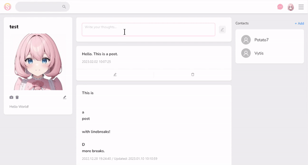

# SNSUS - React Social Media App (FE)

[See Site](https://snsus.click/)

## Built With

- [TypeScript](https://www.typescriptlang.org/)
- [ReactJS](https://reactjs.org/)
- [React Query](https://react-query-v3.tanstack.com/)
- [React Router](https://reactrouter.com/en/main)
- [React Redux & Redux](https://react-redux.js.org/)
- [Ant Design](https://ant.design/)
- [react-i18next](https://react.i18next.com/)
- [Redux Persist](https://www.npmjs.com/package/redux-persist)
- [DayJS](https://day.js.org/)

## Project Timeline

### Project Data, Folder Structures and Utilities

✔️ Data models and response handling utilities

### Library Implementations

✔️ React Router: Authentication check and page transitions  
✔️ Redux: Structure establishment and authentication state management

### Login Page

✔️ Handle log-in, log-out process  
✔️ Cookie Handled with HTTP only

- Utilize Session Id to fetch Recent Logins
- Enable SNS Login

### Signup Page

✔️ Add Google ReCAPTCHA  
✔️ Handle sign up process

### Terms Page

✔️ Add terms of service

### Dashboard Page

✔️ Create, read, update, delete posts

- Like, comments on posts
  ✔️ ~~Follow, unfollow users~~ Add, Delete Friends
- Infinite scroll with Intersection Observer API

### Deployment

✔️ Purchase, connect DNS  
✔️ Install SSL certificate  
✔️ Configure Nginx

### Common

✔️ Change language of application

## Functionality

### Login

### Write, Edit, Delete Post

### Send, Accept, Cancel Friend Request

### Change Application Language

### Edit, Upload, Delete Profile Image

## Implementations

### Log In Process

- Client sends login request to [API server](https://github.com/soooooyoung/social-app-server) containing user credentials and API key.
- An [API server](https://github.com/soooooyoung/social-app-server) receives login request from client.
- If user credentials are valid, server queries MySQL database and fetches user information.
- Server removes private data (i.e password) from user data and sends it as response with authToken (Json Web Token) as HTTP Only Cookies.
- Cookies are set in browser by server.
- Client receives and user data, verifies its validity and stores user information in Redux store and local storage (Redux Persist)

### Verifying User Credentials

#### Protected Routes

Implementation of protected Route components to only grant access to authorized users. Authorization check request is sent to server on every Route transitions.

#### HTTP Only Cookie

Every request sent to server carries HTTP only Cookies to verify its authToken stored in browser.

### Redux & Redux Persist (Local Storage)

Redux Persist allows states to be saved in multiple storage environments. While values like user input can be subjected to single component, values that are used throughout the application may be better stored persistently (i.e: currently logged in user). Implementing custom solution to persist those values would require extensive time for debugging and standardizing for cross platforms so I have settled on using Redux Persist.

Current logged in user information is saved in Local Storage through Redux Persist. Upon removing user crendentials, current user information is reset.
